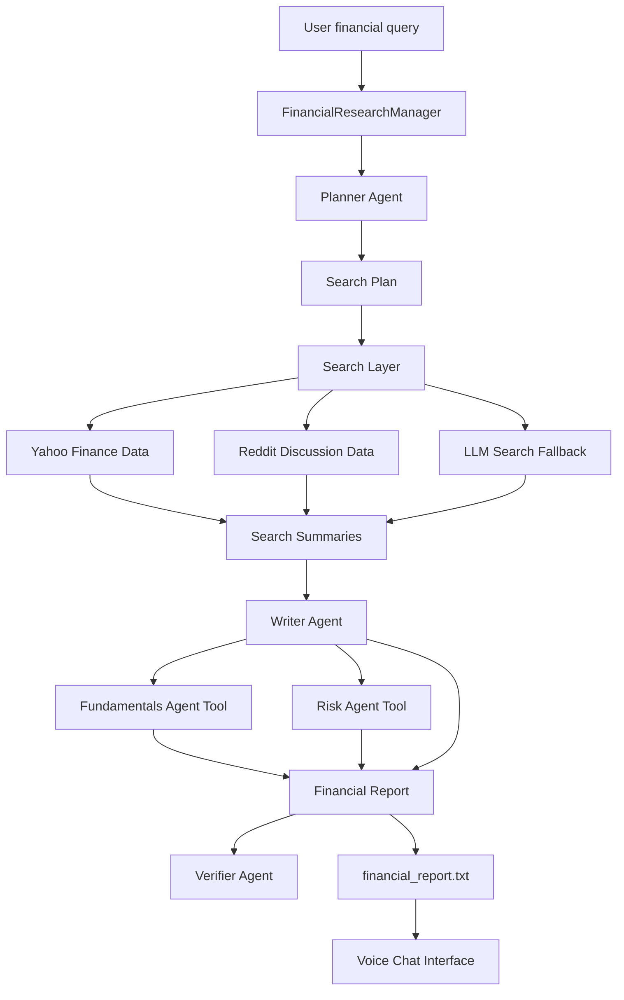

# Financial Research AI Agent

A multi-agent financial research assistant that generates structured company analysis reports and lets users discuss the generated report through a voice interface.

The project combines an OpenAI Agents SDK-style workflow, specialist financial analysis agents, a local Flask data server, Yahoo Finance data, Reddit discussion search, markdown report generation, verification, and optional speech-to-speech interaction.

## Features

- Multi-agent financial research pipeline
- Query planning for financial research tasks
- Yahoo Finance data collection through `yfinance`
- Reddit discussion search through a local Flask API
- LLM fallback when the local data server is unavailable
- Specialist fundamentals and risk analysis agents
- Long-form markdown financial report generation
- Report verification agent for consistency checks
- Saved report output in `financial_report.txt`
- Voice-based report discussion with speech-to-text and text-to-speech
- Textual terminal UI for microphone-based interaction
- Demo mode for showing the workflow without using API credits

## Project Workflow



## How It Works

1. The user enters a financial research query.
2. The planner agent converts the query into 5-15 targeted financial search tasks.
3. The manager runs the searches concurrently.
4. The search layer first tries the local Flask data server.
5. The Flask server fetches data from Yahoo Finance and Reddit.
6. If the server is unavailable, the system falls back to the LLM search agent.
7. The writer agent receives the search results and synthesizes a markdown report.
8. The writer can call the fundamentals and risk agents as tools.
9. The verifier agent checks the final report for consistency and unsupported claims.
10. The report is saved to `financial_report.txt`.
11. The voice assistant can load the saved report and answer follow-up questions.

## Tech Stack

- Python
- OpenAI API
- OpenAI Agents SDK-style local package
- Pydantic
- Rich
- Flask
- Flask-CORS
- yfinance
- requests
- Textual
- sounddevice
- NumPy
- websockets

## Repository Structure

```text
financial_agent/
+-- financial_research_agent/
|   +-- agents/
|   |   +-- financials_agent.py
|   |   +-- planner_agent.py
|   |   +-- risk_agent.py
|   |   +-- search_agent.py
|   |   +-- search_agent_server.py
|   |   +-- verifier_agent.py
|   |   +-- writer_agent.py
|   +-- main.py
|   +-- mainvoice.py
|   +-- manager.py
|   +-- printer.py
|   +-- voice_chat.py
|   +-- voice_demo.py
|   +-- voice_enabled_main.py
|   +-- voice_main.py
|   +-- voice_ui.py
+-- src/
|   +-- agents/
|       +-- agent.py
|       +-- run.py
|       +-- tool.py
|       +-- tracing/
|       +-- models/
|       +-- voice/
+-- demo_financial_agent.py
+-- financial_report.txt
+-- requirements.txt
+-- pyproject.toml
+-- Makefile
+-- VOICE_SETUP.md
```

## Main Components

### FinancialResearchManager

`financial_research_agent/manager.py` is the main orchestration layer. It manages planning, searching, writing, verification, tracing, progress updates, and saving the final report.

### Planner Agent

`financial_research_agent/agents/planner_agent.py` creates a structured search plan from the user's financial query.

### Search Layer

`financial_research_agent/agents/search_agent_server.py` exposes a Flask API with Yahoo Finance and Reddit endpoints.

Available endpoints:

```text
GET  /health
POST /get_yahoo_data
POST /get_reddit_data
```

### Writer Agent

`financial_research_agent/agents/writer_agent.py` creates the final markdown report. It can call specialist agents as tools.

### Fundamentals Agent

`financial_research_agent/agents/financials_agent.py` focuses on revenue, profit, margins, growth, and financial performance.

### Risk Agent

`financial_research_agent/agents/risk_agent.py` focuses on competitive, regulatory, supply-chain, market, and growth risks.

### Verifier Agent

`financial_research_agent/agents/verifier_agent.py` audits the generated report for internal consistency and unsupported claims.

### Voice Interface

The voice system is implemented across:

- `voice_chat.py`
- `voice_ui.py`
- `mainvoice.py`
- `voice_main.py`
- `voice_enabled_main.py`
- `voice_demo.py`

It uses the saved report as context and allows the user to discuss the report through microphone input and audio output.

## Prerequisites

- Python 3.9 or higher
- OpenAI API key
- Internet connection for API calls and external financial/social data
- Microphone and speakers/headphones for voice mode

## Installation

Clone the repository and move into the project directory:

```bash
git clone <your-repository-url>
cd financial_agent
```

Create and activate a virtual environment:

```bash
python -m venv .venv
```

Windows PowerShell:

```powershell
.\.venv\Scripts\Activate.ps1
```

macOS/Linux:

```bash
source .venv/bin/activate
```

Install dependencies:

```bash
pip install -r requirements.txt
```

Optional, if using `uv`:

```bash
make sync
```

## Environment Variables

Set your OpenAI API key before running the project.

Windows PowerShell:

```powershell
$env:OPENAI_API_KEY="your_api_key_here"
```

macOS/Linux:

```bash
export OPENAI_API_KEY="your_api_key_here"
```

## Usage

### 1. Start the Financial Data Server

The research manager can run without this server because it has an LLM fallback, but starting the server enables Yahoo Finance and Reddit data retrieval.

```bash
python financial_research_agent/agents/search_agent_server.py
```

The server runs at:

```text
http://localhost:8000
```

Health check:

```text
http://localhost:8000/health
```

### 2. Generate a Financial Report

Open another terminal and run:

```bash
python -m financial_research_agent.main
```

Example query:

```text
Write up an analysis of Apple Inc.'s most recent quarter.
```

The report is saved to:

```text
financial_report.txt
```

### 3. Run Voice Chat Over the Report

After generating a report, run:

```bash
python -m financial_research_agent.mainvoice
```

In the Textual voice UI:

- Press `K` to start recording.
- Press `K` again to stop recording.
- Press `Q` to quit.

### 4. Run the Voice Demo

```bash
python financial_research_agent/voice_demo.py
```

### 5. Run Demo Mode Without API Calls

If you do not want to use API credits, run:

```bash
python demo_financial_agent.py
```

## Example Output

The generated report includes:

- Executive summary
- Business or company overview
- Financial performance analysis
- Fundamentals analysis
- Risk analysis
- Strategic outlook
- Follow-up research questions
- Verification result

## Testing API and Environment

Run the unit tests:

```bash
python -m pytest tests
```

Check your OpenAI API setup:

```bash
python test_api.py
```

Check installed packages and environment configuration:

```bash
python test_env.py
```

## Troubleshooting

### OpenAI API key is missing

Set the `OPENAI_API_KEY` environment variable before running the app.

### OpenAI quota exceeded

The real agent requires OpenAI API credits. If quota is exceeded, use:

```bash
python demo_financial_agent.py
```

### Flask server is not running

The manager will fall back to the LLM search agent, but Yahoo Finance and Reddit server results will not be available. Start the server with:

```bash
python financial_research_agent/agents/search_agent_server.py
```

### Voice dependencies are missing

Install the required packages:

```bash
pip install sounddevice numpy textual websockets
```

### Microphone is not working

Check your operating system audio permissions and confirm the microphone works in another application.

## Current Limitations

- Yahoo Finance works best when the query includes a clear ticker symbol.
- Reddit data uses a public search endpoint and may be rate-limited.
- Verification checks plausibility and consistency, but it is not a guarantee of factual correctness.
- Voice mode currently works best for discussing an already generated report.
- More automated tests could be added for the full research workflow.

## Future Improvements

- Add automatic company-to-ticker resolution
- Add SEC filing and earnings transcript retrieval
- Add stronger source citation support
- Add financial charts and visualizations
- Add authenticated news and social data providers
- Add direct voice-triggered report generation
- Add unit and integration tests for the agent pipeline
- Add a web dashboard for generated reports

## License

This project is licensed under the MIT License.
